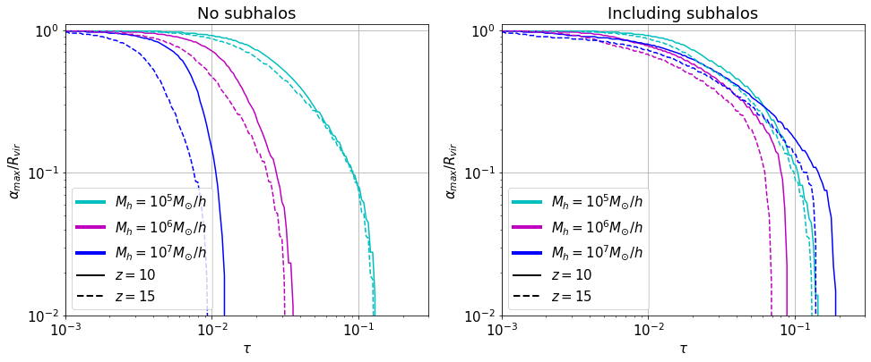

# HAYASHI

### (Halo-level AnalYsis of the Absorption Signal in HI)

(hayashi means *forest* in japanese)

Python library for computing the number of absorption features of the 21 cm forest in a semianalytic formalism. Includes the enhancement of the signal due to the presence of substructures within minihalos, as studied in [arXiv:2209.01305](https://arxiv.org/abs/2209.01305). It supports non-standard cosmologies with impact in the large scale structure, such as warm dark matter and primordial black holes. See the papers [arXiv:2209.01305](https://arxiv.org/abs/2209.01305), [arXiv:2104.10695](https://arxiv.org/abs/2104.10695) for more details.

For comments, questions etc. you can contact me at <pablo.villanueva.domingo@gmail.com>

Impact parameter as a function of the optical depth for halos with and without subhalos