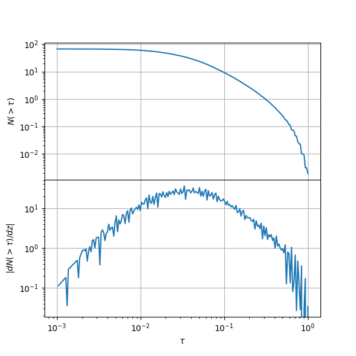

# Usage

The basis of the code is the 21 cm `Forest` class. Given a redshift and the temperature of the intergalactic medium at that epoch, we can define an instance of the state of the 21 cm forest.

```py
from hayashi.forest import Forest
from hayashi.cosmo import Tk_ad

# Define the redshift of interest
z = 10
# Get the adiabatic temperature of the intergalactic medium at z
Tk = Tk_ad(z)

forest = Forest(z, Tk)
```

This allows to call different observables such as the optical depth or the number of absorbers.

```py
# Get a the optical depth, as a matrix in mass and impact parameter
tau = forest.tau_tot

# Get the number of absorption features and its (logarithmic) derivative with respect to tau
Nabs, dNabsdtau = forest.num_absorbers()
```

You can visualize these results with the following script:

```python
import matplotlib.pyplot as plt

fig, (ax1,ax2) = plt.subplots(2,1,sharex=True, figsize=(6,6))
fig.subplots_adjust(hspace=0.)

ax1.loglog(forest.tauvec, Nabs)
ax2.loglog(forest.tauvec[1:],-dNabsdtau)

ax1.set_ylabel(r"$N(>\tau)$")
ax2.set_ylabel(r"$|dN(>\tau)/dz|$")
ax1.set_xlabel(r"$\tau$")
ax2.set_xlabel(r"$\tau$")

ax1.grid()
ax2.grid()

plt.show()
```



*Number of absorbers and its derivative with respect to redshift as a function of the optical depth*

See others examples of usage in the folder `examples`.